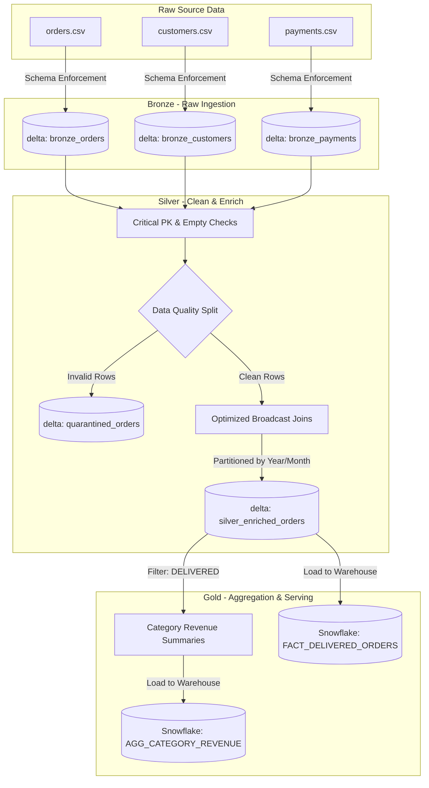

# Enterprise Retail E-Commerce Medallion Pipeline (Databricks + Snowflake)

An end-to-end, production-grade distributed data engineering pipeline built using **PySpark** and **Delta Lake** on **Databricks**, loading final analytics-ready data into a **Snowflake** data warehouse.

This project implements a robust **Medallion Architecture (Bronze -> Silver -> Gold)**, designed with industrial best practices for data validation, performance optimization, and operational resilience. 

---

## 🏗️ Project Architecture & Data Flow



---

## 🛠️ Tech Stack 

| Technology | Role |
| :--- | :--- | :--- |
| **Databricks** | Distributed Compute | Serverless auto-scaling compute, seamless workspace integration, and native support for Delta Lake. |
| **PySpark** | Core ETL Processor | Handles distributed computations on massive datasets. We leverage Spark’s Catalyst Optimizer and Tungsten execution engine. |
| **Delta Lake** | Storage Format | Ensures ACID transactions, schema enforcement, time travel (data versioning), and metadata speedups on top of cloud storage (S3/ADLS). |
| **Snowflake** | Gold Warehouse | Serves as the serving layer for BI tools (e.g., Tableau, PowerBI) and data analysts, decoupling compute from storage. |
| **Apache Airflow** | Orchestration | Custom scheduling, SLA tracking, retries, and modular scheduling using the Databricks connection. |
| **Pytest** | Testing Framework | Ensures data cleansing and validation rules are covered by unit and integration tests before deployment to staging/production. |

---

## ⚡ Key Optimizations & Design Patterns

### 1. Native Catalyst Expressions vs. Python UDFs
* **Problem**: The original pipeline used a Python UDF (`order_bucket_udf`) to categorize orders. Python UDFs act as a black box to the Spark Catalyst Optimizer and require serializing data between the JVM and Python processes, causing severe bottlenecks.
* **Optimization**: Replaced the Python UDF with native `pyspark.sql.functions.when` expressions. This allows calculations to run directly inside the JVM, utilizing Tungsten's memory management and Spark’s code generation.

### 2. Broadcast Joins for Star-Schema Lookup
* **Optimization**: Since `customers` (10k rows) is a small dimension table relative to the `orders` facts (100k+ rows), we wrapped the customer dataframe in `broadcast()`. This copies the small table to all executors, eliminating the need to perform a costly network shuffle of the massive `orders` dataframe.

### 3. Fail-Proof Data Quality System (DQS) & Quarantine Pattern
* **Critical Checks**: The pipeline immediately aborts if primary keys (`order_id`, `customer_id`) contain `NULL`s or if the source files are empty (indicative of upstream failure).
* **Quarantine Pattern**: Minor anomalies (such as negative prices, quantities $\le 0$, or discounts $> 100\%$) are filtered out and written to a `quarantined_orders` table with metadata detailing the validation failure time and reason. The clean rows continue to the warehouse uninterrupted. This guarantees **high pipeline availability** and prevents data loss.

### 4. Partition Pruning
* **Optimization**: Enriched silver orders are written partitioned by `year` and `month` generated from the `order_date`. This enables downstream queries to bypass reading irrelevant partitions, reducing I/O costs.

---

## 📂 Project Structure

```text
├── config/
│   ├── __init__.py
│   └── config.py             # Environment configurations (Local/Prod, Snowflake)
├── dags/
│   └── ecommerce_dag.py      # Production Airflow DAG specification
├── jobs/
│   └── databricks_job.json   # Databricks Workflow multi-task specification
├── src/
│   ├── __init__.py
│   ├── spark_session.py      # Adaptive Spark Session factory (supports local Delta)
│   ├── ingestion.py          # Bronze raw schema enforcement and Delta writer
│   ├── transformation.py     # Silver/Gold core transformations & optimizations
│   ├── validation.py         # Schema validations and Quarantine splitting
│   ├── warehouse.py          # Gold loading logic (Snowflake with local fallback)
│   └── main.py               # Central Medallion orchestrator script
├── tests/
│   ├── __init__.py
│   ├── conftest.py           # Reusable pytest SparkSession fixture
│   └── test_transformation.py# Transformation & DQS assertions
├── requirements.txt          # Python package requirements
└── README.md                 # Project documentation
```

---

## 🚀 How to Run Locally

The pipeline is designed to be **fully testable locally** without needing a live Databricks cluster or Snowflake warehouse. If Snowflake configurations are missing, it falls back to local Parquet files.

### 1. Prerequisites
Ensure you have **Java 17 (or 11)** installed on your machine.

### 2. Set Up Virtual Environment & Dependencies
```bash
python -m venv venv
source venv/bin/activate  # On Windows: venv\Scripts\activate
pip install -r requirements.txt
```

### 3. Generate Mock Data
We've provided a script to seed local files, including 1% anomalous records to test the Quarantine engine:
```bash
python -c "from scratch.generate_test_data import generate_data; generate_data('.')"
```

### 4. Run Pytest Suite
Verify the ETL logic and quality validations using the automated test suite:
```bash
python -m pytest tests/
```

### 5. Run the Pipeline
Execute the full Medallion workflow:
```bash
python -m src.main
```
*Note: Clean results are stored under `storage/silver/enriched_orders`, quarantined anomalies under `storage/silver/quarantined_orders`, and warehouse fallbacks in `data/warehouse_fallback`.*

---


